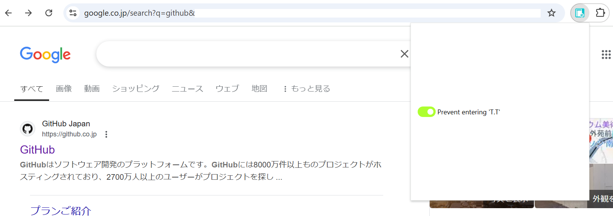
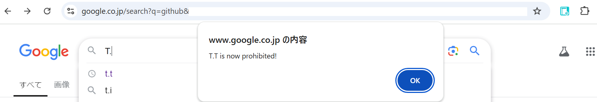

# Crying Letter Preventer

## Overview

Chromeでテキストを入力する際に「T.T」の入力を防いでくれるChrome Extensionです。 
ネット上ですぐにくじけて「T.T」(泣き顔)したくない！という個人的な思いから作りました。  

機能はボタン一つでON・OFFが可能です。 
Chromeブラウザーでのみ使用可能です。
ブラウザーを閉じても再び開いた時に設定は保持されています。  

## How to run

1. git clone https://github.com/sarifor/crying-letter-preventer.git
2. chrome://extensions/に接続し、画面の右上にある「デベロッパーモード」をON
3. 画面の左上の「パッケージ化されていない拡張機能を読み込む」を選択し、フォルダごとアップロード
4. Chrome Extensionを実行してボタンをON
5. 任意のウェブページ（google.co.jpがおすすめ）にアクセスし、「T.T」の入力ができないことを確認

## Screenshots

