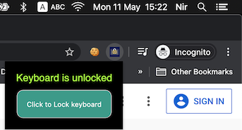
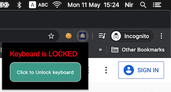

# 작성 계기
컴퓨터로 글을 쓰다 보면 나도 모르게 우는 표정 T.T을 붙이는 때가 있는데, 
그런 습관을 줄이자는 취지에서 만들게 되었다.

# 시장 조사
|카테고리|서비스명|눈에 띄는 기능|비고|
|----|----|----|----|
|크롬  확장프로그램|[Keyboard Lock](https://chromewebstore.google.com/detail/Keyboard%20Lock/egchhmakkadlgkamakegnhokjkbkhjkm?hl=ja&utm_source=ext_sidebar)|버튼을 누르면 크롬 브라우저 상에서 키보드를 못 쓰게 됨. 크롬에서 키보드 기능을 제한한다는 점과, 작은 팝업, 현재 상태, 상태 전환 버튼 세 개가 다인 심플한 디자인을 참고할 만함.    |N/A|

# 원하는 기능
크롬 오른쪽 상단에서 확장 프로그램 아이콘을 클릭하여 접근. 
아이콘을 클릭하면 작은 팝업이 뜸. 
'Prevent Crying 'T.T'' 문장 아래 ON/OFF 토글 버튼이 있음. 
ON이면 T.T와 같이 우는 표정을 입력하는 것을 막음. 
OFF면 입력에 제한 없어짐.