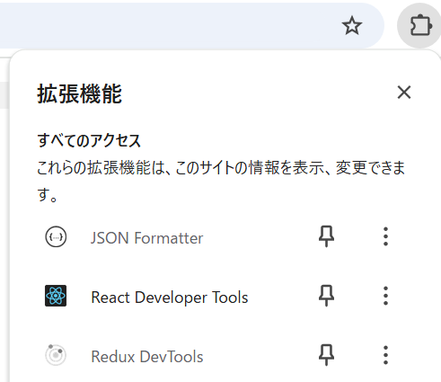
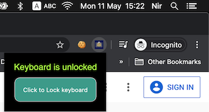

# 기능 요구사항 정의

| 기능 요구사항 | 내용 |
| ------------ | ---- |
|아이콘|크롬 오른쪽 상단에서 확장프로그램 아이콘을 클릭했을 때,  Crying Letter Preventer 확장프로그램을 한눈에 구분할 수 있게 해주는 눈에 잘 띄는 아이콘.  |
|팝업|아이콘을 클릭하면 크롬 화면을 거의 가리지 않을 사이즈로 작게 뜸.  |
|토글 버튼|ON/OFF를 버튼 하나로 쉽게 전환할 수 있도록 해 줌.  ON일 때는 T.T를 입력하지 못하게 제한하고, OFF일 때는 그런 입력 제한이 없어짐.|