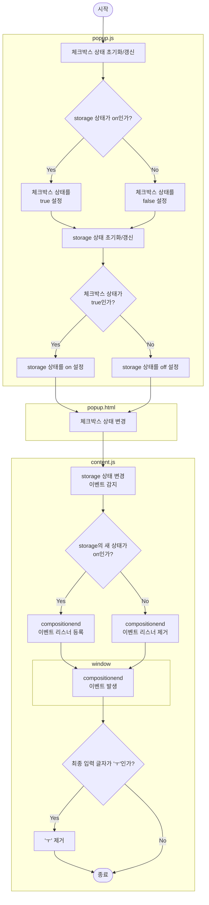

# 플로차트

```mermaid
flowchart TD
  %% Q. 준비 작업, 처리할 작업, 결과 등, 각 유형별 알맞은 순서도 기호?
  %% Q. node1은 '체크박스 상태 초기화'가 더 나을까?

  start1([시작])

  node1[체크박스 상태 초기화/갱신]
  switch1{storage 상태가 on인가?}
  switch1-Y[체크박스 상태를<br>true 설정]
  switch1-N[체크박스 상태를<br>false 설정]

  node3[storage 상태 초기화/갱신]
  switch3{체크박스 상태가<br>true인가?}
  switch3-Y[storage 상태를 on 설정]
  switch3-N[storage 상태를 off 설정]

  node2[체크박스 상태 변경]

  node4[storage 상태 변경<br>이벤트 감지]
  switch4{storage의 새 상태가<br>on인가?}
  switch4-Y[compositionend<br>이벤트 리스너 등록]
  switch4-N[compositionend<br>이벤트 리스너 제거]

  node5[compositionend<br>이벤트 발생]
  switch5{최종 입력 글자가 'ㅜ'인가?}
  switch5-Y['ㅜ' 제거]

  end1([종료])


  start1 --> node1 --> switch1
  switch1 -- Yes --> switch1-Y
  switch1 -- No --> switch1-N
  switch1-Y & switch1-N --> node3
  
  node3 --> switch3
  switch3 -- Yes --> switch3-Y
  switch3 -- No --> switch3-N
  switch3-Y & switch3-N --> node2

  node2 --> node4
  %% node2 --> switch1

  node4 --> switch4
  switch4 -- Yes --> switch4-Y
  switch4 -- No --> switch4-N
  switch4-Y & switch4-N --> node5
  
  node5 --> switch5
  switch5 -- Yes --> switch5-Y --> end1
  switch5 -- No --> end1

  
  subgraph popup.js
    node1
    switch1
    switch1-Y
    switch1-N

    node3
    switch3
    switch3-Y
    switch3-N
  end

  subgraph popup.html
    node2
  end

  subgraph content.js
    node4
    switch4
    switch4-Y
    switch4-N

    subgraph window
      node5
    end
    
    switch5
    switch5-Y
    end1
  end
```