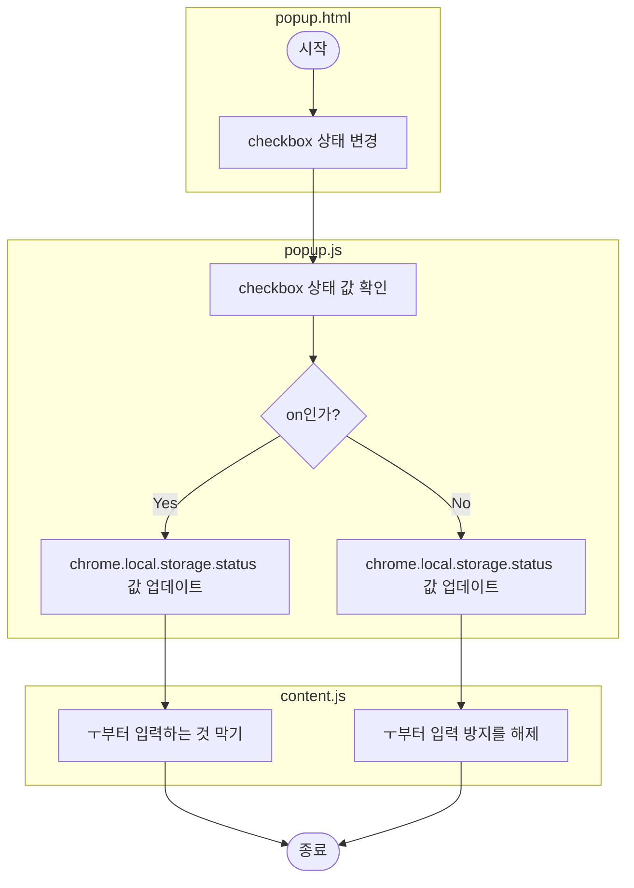

# 플로차트

```mermaid
flowchart TD
  start1([시작])
  node1[checkbox 상태 변경]
  node2[checkbox 상태 값 확인]
  switch1{on인가?}
  node5[chrome.local.storage.status 값 업데이트]
  node3[ㅜ부터 입력하는 것 막기]
  node6[chrome.local.storage.status 값 업데이트]
  node4[ㅜ부터 입력 방지를 해제]
  end1([종료])

  subgraph popup.html
   start1
   node1
  end

  subgraph popup.js
    node2
    switch1
    node5
    node6
  end

  subgraph content.js
    node3
    node4
  end

  start1 --> node1 --> node2
  node2 --> switch1
  switch1 -- Yes --> node5 --> node3
  switch1 -- No --> node6 --> node4
  node3 & node4 --> end1
```