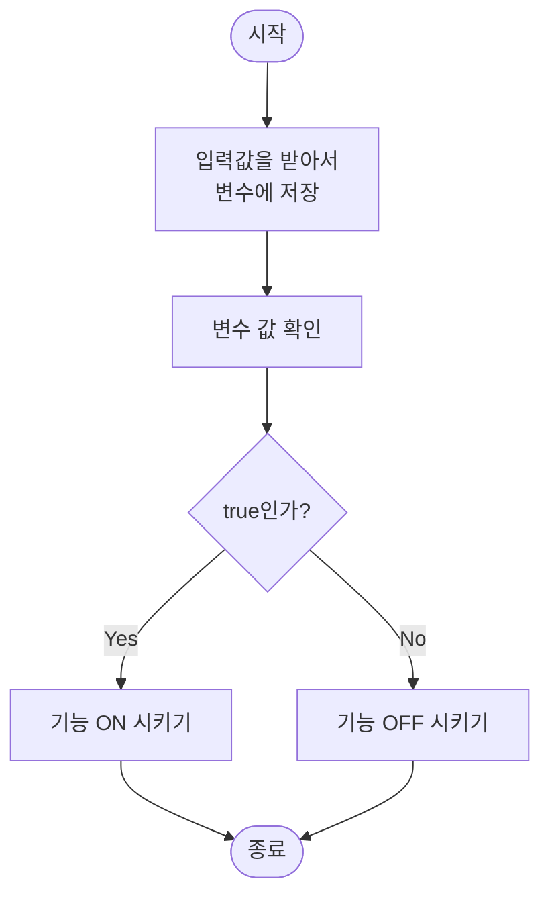

# 플로차트

```mermaid
flowchart TD
  start1([시작])
  node1[입력값을 받아서<br>변수에 저장]
  node2[변수 값 확인]
  switch1{true인가?}
  node3[기능 ON 시키기]
  node4[기능 OFF 시키기]
  end1([종료])

  start1 --> node1 --> node2
  node2 --> switch1
  switch1 -- Yes --> node3
  switch1 -- No --> node4
  node3 & node4 --> end1
```